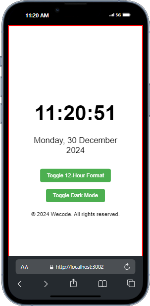

# Digital Clock with 12/24 Hour Format and Light/Dark Themes

A simple React-based digital clock that allows users to switch between 12-hour and 24-hour time formats and toggle between light and dark themes. The clock updates every second and also displays the current date.

## Features

- **Toggle Time Format**: Switch between 12-hour and 24-hour clock formats.
- **Light/Dark Theme**: Toggle between light and dark themes for the clock.
- **Real-time Update**: The clock updates every second.
- **Date Display**: The app displays the current day, month, year, and weekday in a readable format.

## Screenshots



## Demo

You can view the demo of the app by visiting [Digital Clock](https://digital-clock-ewwtwlop5-foxsugarprotonmes-projects.vercel.app/).

## Installation

To run the app locally, follow these steps:

1. Clone this repository:
   ```bash
   git clone https://github.com/thapeloboya/digital-clock.git
